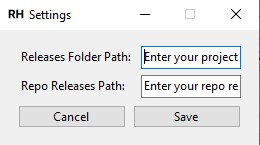

# Release Helper

Release Helper is a small tool that was created to speedup creation of the change sql files in the right sprint folder, depending on the user story type selected, sprint and also writing to clipboard the Azure release path. It will also reduce to minimum typos in the folder and file names.

## Main window description

The main window consists of 5 sections:
- Settings - Opens the settings window
- User Story
  - Id - Here you can type the changes file name, initially it was intended to store only the id
  - Type - From this dropdow you can choose between 'Feature' and 'Bug'. This value will affect the sprint folder name suffix and the branch name preffix
- Sprint
  - Name - The sprint number. It is automatically calculated
  - End Date - It's automaticlly calculated
- Azure Release - Both of the next buttons will search for the files based on the entered user story id and take the most recent by sprint and date
  - Copy file name - Writes the file name into your clipboard without the extension
  - Copy Release Path - Writes the repo path to your changes file into your clipboard. It can be adjusted from the settings
- Git and Files
  - Create file - Creates the changes file and the sprint folde if it's missing. The sprint folder name suffix is defined by the choosen user story type. The path to the releases folder can be set from the settings
  - Copy Branch Name - Writes the branch name into your clipboard. It's defined by the choosen user story type and the user story id
 
## Setting window description

Here we have 2 options:
- Release Folder Path - Enter here the path to your local releases folder. Example: "C:\Users\your\path"
- Repo Release Path - Enter here the repo path to your releases folder. Example: "$(System.DefaultWorkingDirectory)/your/path"
